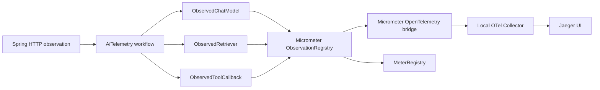
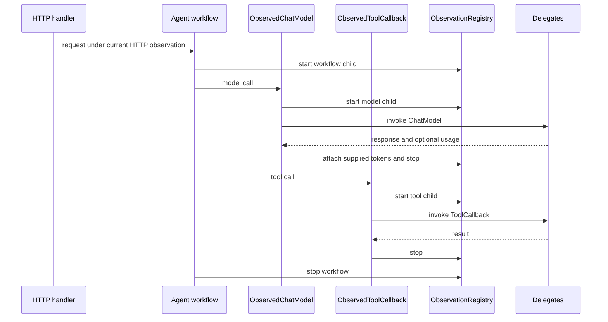

# Spring AI OpenTelemetry Starter

OpenTelemetry-oriented tracing, Micrometer metrics, and safe telemetry conventions for Spring AI model, tool, retrieval, and workflow operations.

## Problem Statement

AI requests cross HTTP handlers, agent orchestration, model providers, retrieval systems, tools, retries, and fallbacks. Without consistent instrumentation, latency and failures are difficult to attribute. Naive tracing can also copy prompts, tool arguments, authorization headers, and provider metadata into telemetry systems.

## What This Project Solves

This starter creates Micrometer observations that the standard OpenTelemetry bridge exports as spans. It supplies wrappers for synchronous and streaming `ChatModel` calls, `ToolCallback` calls, retrieval functions, and arbitrary workflow operations. Existing Spring observations are reused as parents, so an HTTP server span and its AI work form one trace.

Safety defaults are deliberate:

- prompt capture is off
- tool-argument capture is off
- configured JSON fields and HTTP headers can be redacted
- captured values are length-bounded
- malformed JSON is never copied into redacted telemetry
- token values are recorded only when a provider response supplies them
- no hosted telemetry service is required

## When To Use It

Use this starter in Spring Boot applications that need coherent local or production-compatible traces around Spring AI work while retaining control over sensitive content. It works with any Micrometer tracing setup that uses the OpenTelemetry bridge and an OTLP-compatible collector.

It is instrumentation, not a tracing backend. Storage, retention, access control, sampling, and collector operation remain deployment concerns.

## Architecture / HLD



The starter does not create a custom exporter or backend. Spring Boot configures the observation registry and OpenTelemetry bridge; the wrappers add AI-specific names and attributes.

## Detailed Design / LLD



`AiTelemetry` creates low-cardinality operation, provider, model, retry, fallback, and outcome attributes. Prompt and tool-argument content are high-cardinality attributes only when enabled. Errors are attached to the observation and rethrown.

Streaming observations start on subscription and stop on completion, error, or cancellation. Usage is taken from the final response emitted by the provider.

## Public API / API Structure

| API | Responsibility |
| --- | --- |
| `AiTelemetry` | Generic synchronous and reactive observation boundary |
| `AiOperationContext` | Operation type, name, provider, model, retry, and fallback metadata |
| `TokenUsage` | Nullable provider-supplied input and output tokens |
| `CapturedContent` | Explicit prompt or tool-argument attributes |
| `TelemetryRedactor` | JSON field, header, mode, and length safety |
| `AiTelemetryFactory` | Constructs configured Spring AI and retrieval wrappers |
| `ObservedChatModel` | Synchronous and streaming `ChatModel` instrumentation |
| `ObservedToolCallback` | Tool execution instrumentation |
| `ObservedRetriever<T>` | Retrieval function instrumentation |

## Core Concepts

### Observation parenting

Micrometer assigns a newly started observation to the current observation. When a wrapped model or tool is invoked inside a Spring MVC or WebFlux request, its span is correlated with that HTTP trace. An explicit workflow observation can group a sequence of AI operations.

### Capture modes

Tool arguments support `OFF`, `REDACTED`, and `FULL`:

- `OFF` adds no argument attribute.
- `REDACTED` parses JSON, recursively replaces configured field values, then truncates.
- `FULL` truncates but does not redact and should be enabled only after a security review.

Prompt capture is a separate boolean and is off by default. Prompts are free-form text, so field-based JSON redaction does not apply to them.

### Provider usage

`ObservedChatModel` reads `Usage` from Spring AI `ChatResponseMetadata`. Null input or output token counts remain absent from observations and metrics. The library does not derive, estimate, or price tokens.

## Local Prerequisites

- JDK 21 or newer
- Git
- Docker with Compose only for the local collector and Jaeger stack
- No model credential is needed for the deterministic test suite

## Steps To Run

```bash
git clone https://github.com/aniket-deshkar/spring-ai-otel-starter.git
cd spring-ai-otel-starter
./mvnw verify
```

On Windows:

```powershell
.\mvnw.cmd verify
```

Start the optional local tracing stack:

```bash
cd examples
docker compose up -d
```

Jaeger is available at `http://localhost:16686`. The collector accepts OTLP/gRPC on `4317` and OTLP/HTTP on `4318`.

## Configuration

```yaml
spring:
  ai:
    telemetry:
      enabled: true
      prompt-capture: false
      tool-arguments-capture: redacted
      max-captured-length: 2048
      redacted-fields: [authorization, api_key, password, secret, token]
      redacted-headers: [authorization, cookie, set-cookie, x-api-key]

management:
  otlp:
    tracing:
      endpoint: http://localhost:4318/v1/traces
  tracing:
    sampling:
      probability: 1.0
```

| Property | Default | Meaning |
| --- | --- | --- |
| `spring.ai.telemetry.enabled` | `true` | Enables the starter when an `ObservationRegistry` exists |
| `spring.ai.telemetry.prompt-capture` | `false` | Adds prompt text as a span attribute |
| `spring.ai.telemetry.tool-arguments-capture` | `OFF` | `OFF`, `REDACTED`, or `FULL` |
| `spring.ai.telemetry.max-captured-length` | `2048` | Maximum captured characters, from 1 to 32768 |
| `spring.ai.telemetry.redacted-fields` | security-oriented defaults | Case-insensitive JSON keys |
| `spring.ai.telemetry.redacted-headers` | security-oriented defaults | Case-insensitive header names |

## Usage Examples

Wrap application beans before registering them with an agent:

```java
@Bean
ChatModel observedModel(ChatModel providerModel, AiTelemetryFactory factory) {
    return factory.observeChatModel(providerModel, "openai", "configured-model");
}

@Bean
ToolCallback observedWeatherTool(ToolCallback weatherTool, AiTelemetryFactory factory) {
    return factory.observeTool(weatherTool);
}
```

Group the entire agent flow:

```java
AgentResult result = telemetry.observe(
    new AiOperationContext(
        AiOperationType.WORKFLOW,
        "support-agent",
        null,
        null,
        retryCount,
        fallbackUsed),
    () -> agent.run(request));
```

Instrument retrieval where a Spring AI adapter exposes a function boundary:

```java
Function<String, List<Document>> observed =
    factory.observeRetriever("knowledge-base", vectorStore::similaritySearch);
```

For retry or fallback attempts, use `context.withRetry(count)` and `context.asFallback()`. Keep operation names bounded and application-defined; do not use user IDs, prompts, or request IDs as operation names.

## Testing

`./mvnw verify` runs deterministic tests for HTTP → workflow → model/tool observation parenting, synchronous and streaming models, supplied and unavailable tokens, tool and retrieval wrappers, recursive JSON/header redaction, disabled capture, malformed input, truncation, errors, invalid configuration, timers, and counters.

CI needs no provider credential or hosted telemetry account.

## Observability

Observations use `spring.ai.model`, `spring.ai.tool`, `spring.ai.retrieval`, and `spring.ai.workflow`. Metrics use `spring.ai.telemetry.operation` for duration/count and `spring.ai.telemetry.tokens` for provider-supplied token totals. Captured content and token values are span attributes rather than metric tags.

## Security

- Prompt and tool-argument capture are off by default.
- Prefer `REDACTED` over `FULL` for tool arguments.
- Malformed JSON in redacted mode becomes `[UNPARSEABLE]`; the original is discarded.
- Redaction keys and headers are case-insensitive and configurable.
- Captures are truncated even after redaction.
- Never place identities, secrets, prompts, or arguments in operation names or metric tags.
- Protect collector endpoints and the Jaeger interface outside a developer machine.
- See [SECURITY.md](SECURITY.md) for private reporting.

## Repository Structure

```text
src/main/java/io/github/aniketdeshkar/aiotel/
├── autoconfigure/  Spring Boot properties and bean configuration
├── spring/         ChatModel, ToolCallback, and retrieval wrappers
├── AiTelemetry.java
├── AiOperationContext.java
├── TelemetryRedactor.java
└── TokenUsage.java
src/main/resources/META-INF/spring/
src/test/java/io/github/aniketdeshkar/aiotel/
examples/
├── docker-compose.yml
└── otel-collector-config.yml
```

## Design Decisions / Trade-offs

- Micrometer Observation is the public instrumentation boundary. This preserves Spring HTTP correlation and lets the standard OpenTelemetry bridge handle export.
- Wrappers are explicit rather than bean-post-processing every model or tool. Applications can identify exactly which callbacks are model-visible and avoid double instrumentation.
- Tool redaction requires JSON for predictable field traversal. Invalid content is suppressed in redacted mode rather than copied.
- Streaming spans cover subscription through terminal signal. Cross-thread child operations still require the application's standard Reactor context-propagation configuration.
- Token counts are nullable. Missing provider metadata stays missing instead of becoming misleading zero values.
- The local stack uses standard Collector and Jaeger images and stores no repository-owned trace data.

## Contributing

See [CONTRIBUTING.md](CONTRIBUTING.md). Instrumentation changes require tests for success, failure, capture safety, and parent correlation and must pass `./mvnw verify`.

## License

Licensed under the Apache License 2.0. See [LICENSE](LICENSE).
